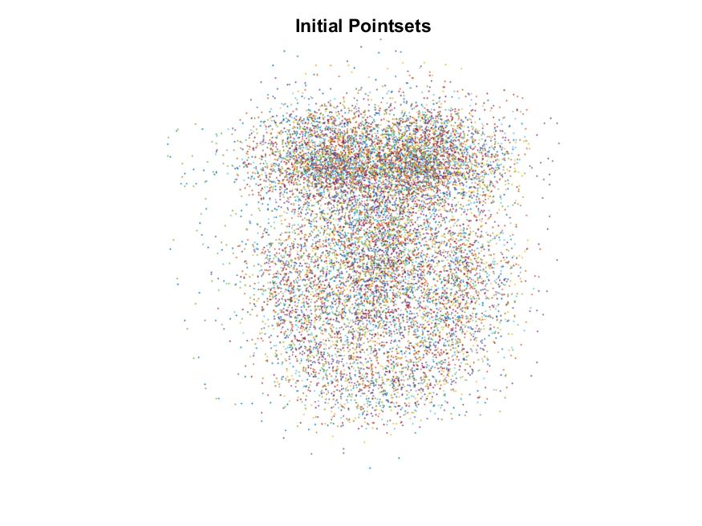

<h1 align="center">Statistical Shape Analysis</h1>
    

  </img>
  </img>
  </img>

  </img>
  </img>
  </img>

Statistical analysis of 2D shapes based on 
["Generalized Procrustes Analysis" (Gower, J.C.)](https://link.springer.com/article/10.1007%2FBF02291478) and 
["Active Shape Models - Their Training and Application" (Cootes et al.)](https://www.sciencedirect.com/science/article/abs/pii/S1077314285710041)
       
## Usage:
See [`code/main_1.mlx`](code/main_2.mlx) for approach based on Generalized Procrustes Analysis and [`code/main_2.mlx`](code/main_2.mlx) for approach based on Active Shape Models.

## Documentation:
*TBD*

---

*(This was done as a course assignment for CS736: Medical Image Computing, Spring 2021, IIT Bombay)*
