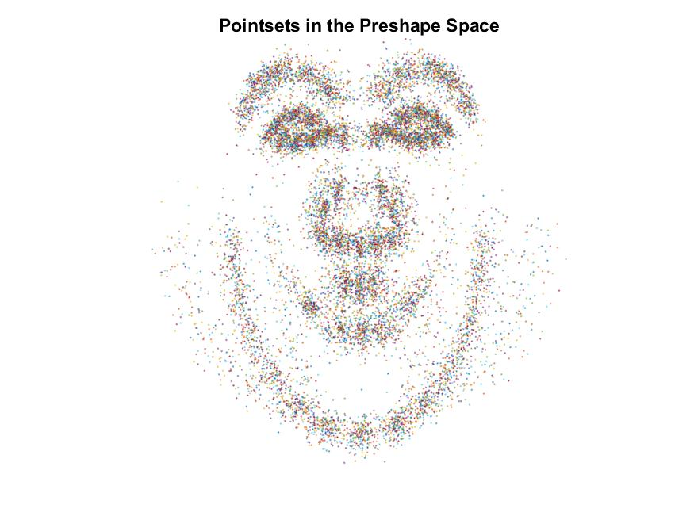

<h1 align="center">Statistical Shape Analysis</h1>
    

  </img>
  </img>
  </img>

  </img>
  </img>
  </img>

Statistical analysis of 2D shapes based on 
["Generalized Procrustes Analysis" (Gower, J.C.)](https://link.springer.com/article/10.1007%2FBF02291478) and 
["Active Shape Models - Their Training and Application" (Cootes et al.)](https://www.sciencedirect.com/science/article/abs/pii/S1077314285710041)  

## Data:
The dataset of 2D face images is publicly available here: [IMM Face Database](http://www.imm.dtu.dk/~aam/datasets/datasets.html).  
Download the data from the above link, place the files [`data_clean.sh`](data/data_clean.sh) and [`to_mat.py`](data/to_mat.py) in the root directory of the downloaded data and run:
  1. `bash data_clean.sh`
  2. `python3 to_mat.py`
This will create [`faces2D.mat`](data/faces2D.mat) in the `data` directory.
       
## Usage:
- See [`code/main_1.mlx`](code/main_2.mlx) for approach based on Generalized Procrustes Analysis and [`code/main_2.mlx`](code/main_2.mlx) for approach based on Active Shape Models.

## Documentation:
 - [`code/main_1.mlx`](code/main_1.mlx) : Main script for the approach based on Generalized Procrustes Analysis
 - [`code/main_2.mlx`](code/main_2.mlx) : Main script for approach based on Active Shape Models
 - [`code/align1.m`](code/align1.m) : Align two given pointsets of equal cardinality via similarity 
    transformations assuming that the pointset representations are standardized to pre-shape space
 - [`code/align2.m`](code/align2.m) : Align two given pointsets of equal cardinality via similarity 
    transformations, solving for the scale, translation, and rotation jointly
 - [`code/optimize1.m`](code/optimize1.m) : Runs the algorithm in the pre-shape space and uses
    `align1.m`
 - [`code/optimize2.m`](code/optimize2.m) : Runs the algorithm in the original space and uses
    align2.m
 - [`code/toPreshape.m`](code/toPreshape.m) : Standardizes the pointset to pre-shape space 
 - [`code/updateMean.m`](code/updateMean.m) : Finds the optimal shape mean given the aligned pointsets
 - [`code/plotPointsets.m`](code/plotPointsets.m) : Plots the set of pointsets as a scatter plot, each
    pointset in a different color
 - [`code/plotWithMode.m`](code/plotWithMode.m) : Plots the pointsets along with two sets of variation about the mean along the given mode of variation

---

*(This was done as a course assignment for CS736: Medical Image Computing, Spring 2021, IIT Bombay)*
